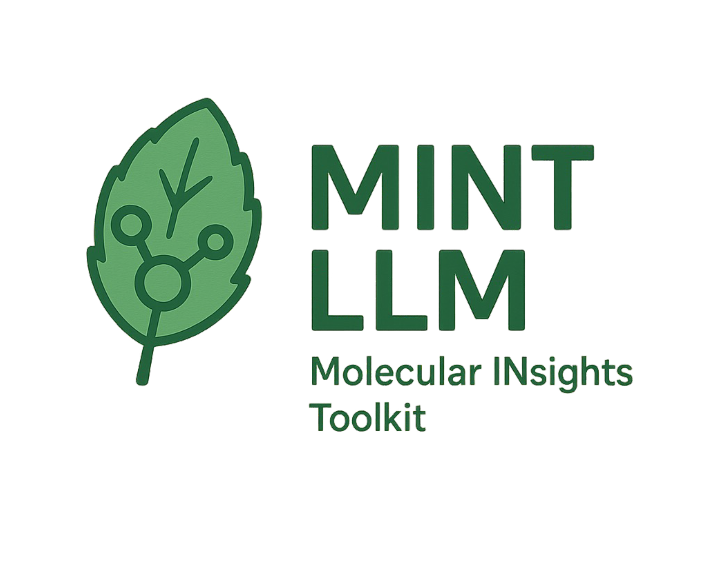

# MINT LLM

Molecular INsight Toolkit (MINT LLM) is a lightweight, AI-assisted platform for analyzing molecular dynamics trajectories. It integrates a natural language interface to automatically compute observables such as volume, density, RDF and RMSD and generate plots. Designed for soft-matter simulations, it makes trajectory analysis fast and reproducible.

The goal of the toolkit is to automate the analysis of MD simulations trajectories with the aid of LLMs. MINT LLM can currently process trajectories from these packages: GROMACS, AMBER and LAMMPS. Simply upload your desired trajectories, visualize your data, and ask the chatbox to help with analysis and relevant summaries!

You can learn how to use MINT LLM here: [Watch the video](https://mint-llm-molecular-i-gvsg.bolt.host/)
